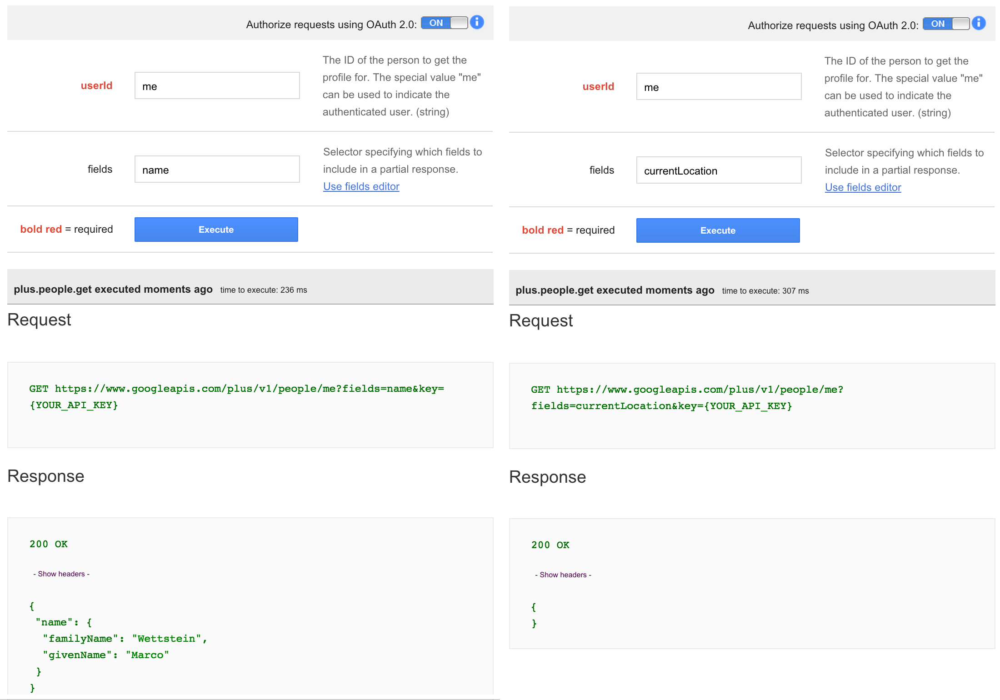

# Einleitung

\pagebreak

# Ausgangslage

## Timetraces

Im Rahmen einer Seminararbeit wurde für die Controlling- und Zeiterfassungs-Applikation "controllr" (siehe Abbildung \ref{fig_controllr}) eine neue Client-Anwendung gebaut, welche durch die Integration verschiedener Dienste wie Github, Redmine und Google Calendar eine Art Protokoll der geleisteten Arbeit erstellt. Aus den Einträgen dieses Protokoll können in der Anwendung direkt Zeiteinträge in "controllr" erstellt werden. Abbildungen \ref{fig_timetraces_1} zeigt das Arbeitsprotokoll von *TimeTraces*. Durch Anwählen eines Eintrages wird eine vor-ausgefüllte Eingabemaske angezeigt, welche den Zeiteintrag über eine REST-Schnittstelle an "controllr" sendet (Abbildung \ref{fig_timetraces_2}).

![\label{fig_controllr} Screenshot von "Controllr" (Quelle [@sem_handheld, p. 6])](fig_controllr.png)

![\label{fig_timetraces_1}Darstellung der Event-Liste eines Tages in *TimeTraces*. Quelle [@sem_handheld, p. 22] ](fig_timetraces_1.png)

![\label{fig_timetraces_2}Eingabemaske für einen Zeiteintrag in *TimeTraces*. Alle Felder werden vorausgefüllt. Quelle [@sem_handheld, p. 23] ](fig_timetraces_2.png)

*TimeTraces* wurde als "Meteor"-Anwendung gebaut (siehe dazu Abschnitt \ref{sec_meteor}) und ist eine Client-Server-Anwendung, welche externe Dienste integriert. Die Anwendung speichert dabei ausser den Benutzer-Logins und den Einstellungen der Benutzer keine weiteren Daten (Siehe Abschnitt \ref{sec_timetraces_nodata}). Sämtliche Daten werden dabei vom Serverteil der Anwendung aggregiert und an den Client gesendet. Die Daten werden vom Server dabei über REST-Schnittstellen in einem Polling-Verfahren abgerufen. Das Polling wird gestartet, sobald der clientseitige Teil der Anwendung die Daten über eine DDP-Subscription abonniert und beendet, sobald der Client die Subscription beendet.

Abbildung \ref{fig_timetraces_arch} zeigt den Ablauf einer Subscription eines Clients.

![Ablauf einer Subscription von *TimeTraces* zwischen Client - Server und externen Quellen. Quelle [@sem_handheld, p. 19]\label{fig_timetraces_arch}](fig_timetraces_arch.png)

### Standortverlauf als weitere Event-Quelle

*TimeTraces* nutzt bisher *Github*, *Google Calendar* und *Redmine* als Event-Quellen. Als weitere Event-Quelle soll nun der Standort-Verlauf des Benutzers genutzt werden. Diese Daten sollen dem Benutzer helfen, die Zeiteinträge genauer zu erfassen. Der Benutzer sieht somit nicht nur, was wann gearbeitet wurde, sondern auch wo. Es löst zudem das Problem, dass es oft schwierig ist, sich an den Startzeitpunkt einer Arbeit zu erfassen: es kann z.b. festgestellt werden, wann das Büro betreten wurde.

### No-Data-Konzept\label{sec_timetraces_nodata}

Im Zeitalter von Cloud-Computing ist es schwierig geworden, genau zu bestimmen, wo die Daten eines Benutzers überall sind und wer die Kontroller über diese Daten hat.

Beim Design von *TimeTraces* wurde dies berücksichtig, indem nur die nötigsten Daten, wie Einstellungen von Benutzer gespeichert werden. Die verwendeten Daten der Event-Quellen, wie Kalender udn Github werden dabei nicht dupliziert und gespeichert, sondern lediglich an die Client-Anwendung weitergeleitet. 

\pagebreak

## Standort-Dienste und MQTT

Die Fähigkeiten zur Standort-Bestimmung (GPS, o.ä.) auf Smartphones ermöglicht viele Anwendungen, wie Navigation, Standort-bezogene Informationen oder Protokollierung für Sportler, Wanderer, o.ä. Es existieren viele Dienste zum diesem Thema, unter anderem von Google, wie *Google+* oder den eingestellten Dienst *Google Latitude*. Im mobilen Betriebsystem *Android* ist die Standort-Bestimmung zudem seit den ersten Versionen ein wichtiges Feature.

Neben solchen Cloud-Diensten existieren auch Systeme, welche auf eigener Infrastruktur - und damit unabhängig von Drittanbieter betrieben werden können.

Ein solches System ist die Anwendung *OwnTracks*, welche als Ersatz für den eingestellten Dienst *Google Latitude* entwickelt wurde. Sie kann auf IOS- und Android-Geräten installiert werden und kommuniziert über einen *Broker* über das Protokol *MQTT*, welches als *Protokol des Internets der Dinge* standardisiert werden.

\pagebreak

# Aufgabenstellung

Auf einem mobilen Endgerät des Benutzers soll eine Anwendung laufen, welcher seinen Standort periodisch an eine zentrale Stelle übermittelt.

Die Anwendung *TimeTraces* wird um eine Funktion erweitert, welche diese Daten abfragt und auswertet. Der Benutzer soll dabei sehen, zu welchem Zeitpunkt er sich an welchem Standort aufgehalten hat. Die Daten werden also nicht in Echtzeit benötigt (wie es beispielsweise häufig bei Standort-basierter Werbung der Fall ist), sondern mit Verzögerung (einige Tage bis wenige Wochen).

Als Übertragungsprotokoll soll dabei *MQTT* verwendet werden

## Zielsetzung

Die Ziele dieser Arbeit sind 

- Vertiefung in das Thema MQTT
- Betrachtung sicherheitsrelevanter Aspekte von MQTT, 
- Betrachtung generell sensitiver User-Daten, wie Standortverlauf
- Setup einer geeigneten MQTT-Broker-Lösung mit geeigneten Sicherheitseinstellungen
- Verbinden von *OwnTracks* oder einer ähnlichen Anwendung und *TimeTraces* via MQTT und dem gewählten Broker
- 

# Recherche

## Standord-Dienste

### Google Latitude

*Google Latitude* war ein Dienst, welche es einem Benutzer ermöglichte, seinen Standort an seine Freunde zu senden und zu sehen, wo sich seine Freunde aufhalten.

Der Dienst wurde eingestellt. [^fn_google_latitude]

[^fn_google_latitude]: Siehe [@google_latitude]

### Google+

Im Sozialen Netzwerk *Google+* ist es möglich, seinen Standort an Freunde zu teilen. Der Dienst nutzt dabei das mobile Endgerät des Benutzers für die Strandort-Protokollierung, sofern man die entsprechende App installiert hat.

Über eine *API* lassen sich Daten des Sozialen Netzwerkes programmatisch abfragen. Über 

`GET https://www.googleapis.com/plus/v1/people/userId` 

lassen sich Profil-Daten eines Benutzers abfragen. Wählt man `me` als `userId`, so kann das eigene Profil abgefragt werden. Die Dokumentation der Schnittstelle[^fn_google_plus_api] erwähnt das Feld `currentLocation` als den aktuellen Standort der Person. Eine Test der Schnittstelle hat aber ergeben, dass das Feld nicht existiert. Auch eine gezielte Abfrage wie in Abbildung \ref{fig_google_plus_api} gezeigt, ergab, dass das Feld nicht existiert.

Es handelt es sich hier offenbar um einen Fehler. Im *issue-tracker* der *google-plus-platform* ist ein entsprechender Eintrag[^fn_google-plus-platform] verfasst word mit dem Datum 24.07.2013. Bis zum Zeitpunkt des Erfassens dieser Arbeit ist keine Lösung zum Problem eingegangen.

[^fn_google_plus_api]: Siehe [@google_plus_api]
[^fn_google-plus-platform]: Siehe [@google-plus-platform]

### OwnTracks

Owntracks wurde als Ersatz für den eingestellten Google Standort-Dienst "Latitude" entwickelt und ursprünglich in Anlehnung an das Vorbild und dem Verwendeten Protokoll als *MQTTitude* bezeichnet. [^fn_git_owntracks]

Die Anwendung zeichnet den Standort des Benutzers im Hintergrund auf und sendet die Daten an einen zu definierenden MQTT-Broker unter einem wählbaren *Topic* (Siehe Abschnitt \ref{sec_mqtt_broker}). Dabei können verschiedene Einstellungen wie die Häufigkeit der Standortprotokollierung

OwnTracks ist als quelloffene Anwendung für IOS und Android erhältlich und ist unter der *Eclipse Public Licence* veröffentlicht. [^fn_licence_owntracks]

Die Verwendung von *OwnTracks* ist im Rahmen dieser Arbeit als Ausgangslage vordefiniert und gibt das Protokoll *MQTT* vor, es sollen aber auch Alternativen betrachtet werden [^fn_owntracks_alternatives]

[^fn_owntracks_alternatives]: Owntracks nutzt MQTT als Übertragungsprotokoll. Es ist aber auch denkbar, dass anderen Anwendungen ein anderes Protokoll verwenden.
[^fn_git_owntracks]: Siehe Quelle [@git_owntracks]
[^fn_licence_owntracks]: Lizenz und Quelle unter [@licence_owntracks]

TODO: reinnehmen?

https://play.google.com/store/apps/details?id=com.glympse.android.glympse
http://onetouchlocation.creativeworkline.com/

## MQTT

*MQ Telemetry Transport* oder kurz *MQTT* ist ein Protokoll für die Maschine-zu-Maschine-Kommunikation von Telemetrie-Daten. MQTT wurde insbesondere für Leistungsschwache Endgeräte entwickelt, sowie für Netzwerke mit hoher Verzögerung oder geringer Leistung. So wurde MQTT auch für die Kommunikation über Satelliten genutzt. [^fn_mqtt_satellit]

MQTT wurde 1999 von Dr Andy Stanford-Clark (IBM) und Arlen Nipper (Arcom, Eurotech) entwickelt. [^fn_mqtt_faq]

[^fn_mqtt_faq]: Siehe [@mqtt_faq]

### Netzwerklayer und Sicherheit

MQTT ist im TCP/IP-Referenzmodell in der Anwendungs-Schicht angesiedelt und nutzt TCP als Übetrtragungsprotokoll. Die Übetragung kann mittels SSL/TSL verschlüsselt werden, allerdings erhöht das den Leistungsbedarf der Übertragung signifikant. MQTT sieht innerhalb des Protokolles keine Verschlüsselung vor, es ist jedoch möglich, sich mittels Benutzername und Passwort zu authentifizieren. [^fn_mqtt_faq]

Mit *MQTT-SN* steht eine Variante für nicht-TCP/IP-Netzwerke, wie *ZigBee* zur Verfügung. [^fn_mqtt_sn]

[^fn_mqtt_sn]: Siehe [@mqtt_sn].

### Anwendungen

Durch diese Optimierungen ist MQTT für Sensoren, wie Temperatur-, Feuchtigkeits oder Durckmesser, Lichtschalter, Bewegungsmelder und Aktoren, wie Lampen, Motoren, Relais oder ähnliches geeignet. MQTT wurde 2013 als Protokoll des *Internets der Dinge* standardisiert und bietet somit beispielsweise eine standardisierte Übertragungsmöglichkeit für die Hausautomation. [^fn_mqtt_wiki]

[^fn_mqtt_satellit]: Siehe Einleitung unter der Offiziellen Seite von MQTT [@mqtt_org].
[^fn_mqtt_wiki]: Quelle [@mqtt_wiki]

Durch die geringe Leistungsaufnahme ist MQTT ebenfalls geeignet für mobile Endgeräte, wie Smartphones, wo lange Akkulaufzeit und geringe Datenübertragung wünschenswert sind.

 

### Topics und Publish-Subscribe

MQTT folgt dem Konzept einer *Message oriented Middleware* und ermöglicht das *Beobachter-Entwursfmuster*, welches auch *publish-subscribe* genannt wird. [^fn_observer_pattern] Dabei *abonnniert* ("subscribe") ein Client ein bestimmtes *Topic*. Ein Client kann auf ein *Topic* eine Nachricht *veröffentlichen* ("publish"), welche dann alle Clients erhalten, die dieses *Topic* abbonniert haben. Ein *Broker* dient dabei als Vermittler zwischen den Clients und leitet die Nachrichten an die für sie bestimmten Clients weiter. (Siehe Abschnitt \ref{sec_mqtt_broker})

[^fn_observer_pattern]: Siehe Quelle [^fn_observer_pattern].

### Qualitiy of Serivce (QoS)

MQTT sieht 3 Stufen für die Übertragungs-Qualität einer Nachricht vor:

QoS 0 - At most once delivery:	Die Nachricht wird **höchstens einmal** zugestellt. Nachrichten mit QoS 0 können verloren gehen, wenn ein Client die Verbindung unterbricht oder ein Broker offline ist. Der Vorteil an QoS 0 liegt primär in der Performance, da Nachrichten nicht zwischengespeichert und nicht protokolliert werden muss, welcher Benutzer welche Nachricht erhalten hat.

QoS 1 - At least once delivery:	Clients und Broker versuchen, die Nachrichten **mindestens einmal** zuzustellen. Es ist möglich, dass Nachrichten mehrfach zugestellt werden. [^fn_mqtt_ibm] 

QoS 2 - Exactly once delivery:	Diese Stufe garantiert, dass eine Nachricht genau einmal zugestellt wird. Die Stufe stellt somit wie QoS 1 den Empfang einer Nachricht sicher und vermeidet dabei Duplikate. QoS 2 stellt somit die höchste Qualitätsstufe der Übertragung dar und erfordert damit auch mehr Komplexität und Rechenleistung in Client und Broker. 

[^fn_mqtt_ibm]: Die in der Quelle [@mqtt_ibm] angebene Seite zeigt eine Übersicht über MQTT und die Verschiedenen QoS-Level.

### Broker\label{sec_mqtt_broker}

*Broker* verbinden die verschiedenen Clients und dienen als Vermittler der Nachrichten. Sie nehmen Nachrichten von Clients entgegen und senden sie an andere Clients, welche das *Topic* der Nachricht abbonniert haben. Broker berücksichtigen dabei die QoS-Stufe der Nachricht und müssen bei entsprechender QoS-Stufe Nachrichten auch Zwischenspeichern. 

## Verfügbare MQTT-Broker

### Mosquitto

*Mosquitto* ist ein quelloffener MQTT-Broker und wurde unter der BSD-Lizenz veröffentlicht. Für verschiedene Plattformen und Betriebsysteme stehen vorkompilierte Pakete als Download oder in Paketmanagern zur Verfügung. [^fnMosquitto]

Der Broker kann auf einem eigenen Server installiert werden, setzt somit aber bestehende Infrastruktur voraus. 

*Mosquitto* speichert Daten im Arbeitspeicher und persistiert die Daten periodisch auf den Datenträger. [^fn_mosquitto_ autosave_interval]

Weiterhin kann Mosquitto sich mit weiteren Brokern via *Bridge* verbinden. [^fn_mosquitto_bridge]

[^fn_mosquitto_bridge]: Siehe [@mosquitto_bridges]

[^fn_mosquitto_ autosave_interval]: Siehe Option * autosave_interval* in Quelle [@mosquitto_general_options]

#### Verschlüsselung und Authentifizierung

Mosquitto erlaubt Zertifikat-basierte Veschlüsselung mittels TLS/SSL. Der Server weisst dabei an den Client ein Zertifikat aus, welches der Client verifiziert. Umgekehrt besteht die Option, dass der Client sich gegenüber dem Server ebenfalls mit einem Zertifikat authentifizieren muss. Dies kann dazu genutzt werden, einen User zu identifzieren. Ohne Client-Zertifikat ist auch eine Authentifizierung mittels Benutzername und Passwort möglich. Statt eines Zertifikates kann auch ein *pre-shared-key*-Verfahren genutzt werden, wobei vorgängig ein Schlüssel ausgetauscht wird. [^fn_mosquitto_auth]

Nutzt mann die Client-Authentifizierung, so ist es möglich, die Zugriffsrechte eines Clients auf einzelne Topics einzuschränken. Dabei können für ein Topic reine Lese- und Schreibrechte oder Beides vergeben werden. [^fn_mosquitto_acl] Es ist darüber hinaus auch möglich, nicht-authentifizierte Benutzer auszuschliessen.

Mosquitto unterstützt weiterhin die Kommunikation über Websockets, d.h. es kann via Websockets direkt mit dem MQTT-Broker kommuniziert werden.

[^fnMosquitto]: Siehe [@mosquitto]
[^fn_mosquitto_auth]: Siehe [@mosquitt_auth]
[^fn_mosquitto_acl]: Siehe Option * acl_file* in Quelle [@mosquitto_general_options]

### HiveMQ

*HiveMQ* ist ein laut Hersteller für Unternehmen optimierter MQTT-Broker und zeichne sich durch hohe Performance, gute Skalierbarkeit (durch Clustering), hohe Sicherheit, sowie 100%iger MQTT 3.1.1 Unterstützung überzeugen.

Wie Mosquitto untertützt HiveMQ Kommunikation über Websockets, (X509) Zertifikat-Authentifizierung, sowie Bridging.

HiveMQ ist kostenpflichtig, es stehen monatliche Lizenzen oder einmalige Lizenzen zur Verfügung. Die Kosten für die einmalige Lizenz bewegen sich zwischen 325 € und 6250 €. Eine kostenlose Testversion steht ebenfalls zur Verfügung.

### Moquette

*Moquette* ist ein Quelloffener MQTT-Broker, welcher in Java implementiert ist. Er steht unter der Apache License 2.0.

Der Broker wird aktiv weiterentwickelt, unterstützt aber weniger Funktionen von MQTT als Mosquitto oder HiveMQ. So ist es u.a. noch nicht möglich, Zugriffsrechte für einzelne User zu setzen. QoS 0,1 und 2 werden unterstützt. [^fn_moquette_git]

[^fn_moquette_git]: Siehe [@moquette_git]

### Mosca

Dieser Broker ist als *node.js*-Applikation und über den *Node Package Manager* (*npm*) erhältlich. Er kann direkt als Broker genutzt werden oder in einer anderen *node.js*-Applikation als Modul genutzt werden.

Mosca ist MQTT 3.1 kompatibel, unterstützt aber nur QoS 0 und 1. Nachrichten können auf einer MongoDB oder Redis-Datenbank persistiert werden.

Der Quellcode von Mosca ist unter Github veröffentlicht, es ist allerdings keine Lizenz angegeben. [^fn_mosca_git]

[^fn_mosca_git]: Siehe [@mosca_git]

### GnatMQ

*GnatMQ* ist ein auf dem .NET-Framework von Microsoft basierender MQTT-Broker. Er unterstützt alle 3 QoS-Stufen, Authentifizierung via Benutzername/Passwort, sowie Zugriffskontrolle, jedoch noch keine SSL/TLS-Verbindunng und kein *Bridge*-Modus.

### Gehostete MQTT-Broker 

Statt einer selbst verwalteten Lösung, kommen auch Cloud-Dienste in Frage (*software as a service*). 

#### CloudMQTT

*CloudMQTT* ist ein gehosteter MQTT-Broker. Es gibt ein kostenloses Abonnement und zwei kostenpflichtige ($19, resp. $99 pro Monat). 

Der Dienst unterstützt u.a. Authentifizierung, Zugriffskontrolle (*ACL*), *Bridge*-Modus, sowie Kommunikation über Websockets.

[^fn_cloud_mqtt]

[^fn_cloud_mqtt]: [@cloud_mqtt]

### Vergleich

#### Self-Hosted gegen Cloud-Lösung

Bei Standort-Daten handelt es sich um sensible Daten. Diese besitzen auch einen gewissen *Business Value*, was bei Standort-basierter Werbung zu sehen ist. Bei Cloud-Lösungen wird die Kontrolle über diese Daten an einen Fremdanbieter abgegeben. Im Rahmen dieser Arbeit ist dies zweitrangig; in einer produktiven Anwendung ist dies aber nicht zu vernachlässigen.

Cloud-Lösungen bieten aber den Vorteil des einfacheren Setup. Skalierung und Betrieb kann ebenfalls an den Anbieter abgegeben werden.

#### Detailvergleich

(TODO: Tabelle)

### Wahl

Alle untersuchten Broker kämen prinzipiell in Frage (bei den Kostenpflichtigen in einer Test-Version), die Wahl fiel jedoch auf Mosquitto, da dieser sehr gut dokumentiert ist und sehr viele MQTT-Features unterstützt. Somit kann sich mit vielen Aspekten von MQTT auseinandergesetzt werden.

Für die Installation steht u.a. eine (virtuelle) Ubuntu Instanz (12.04 LTS) in einem Rechenzentrum zur Verfügung.

\pagebreak

# Konzept & Design

## Sicherheitsapsekte

### Sensible Daten

Standortdaten sind sicherheitsrelevant. Es handelt sich um sensible Daten, die insbesondere vor Missbrauch geschützt werden müssen.

### Verschlüsselung

TODO

### Authentifizierung

TODO

## Architektur\label{sec_arch}
 

Die Standort-Daten des Benutzers werden nicht in Echtzeit, sondern mit Verzögerung benötigt, um nachträglich den Standort-Verlauf des Benutzers zu rekonstruieren. Es ist also nötig, die Daten zwischenzuspeichern.

Da die Anwendung *TimeTraces* ein Server-Teil hat, könnte dieser für die Standortdatenspeicherung in Frage kommen.

Dagegen spricht aber, dass *TimeTraces* aus konzeptuellen Überlegungen keine Event-Daten speichert (siehe Abschnitt \ref{sec_timetraces_nodata}). Möchte man dieses Konzept beibehalten, so muss das Speichern der Daten auf eine andere Anwendung verlagert werden.

Die Broker-Software *Mosquitto* selbst kommt dafür ebenfalls nicht in Frage, da MQTT mit QoS 1 und 2 zwar Nachrichten persistiert, für eine ein- oder mehrwöchige Zwischenspeicherung ist ein Broker aber nicht ausgelegt.

## Standort-Service als Brücke

Um dieses Problem zu lösen, kann ein Service erstellt werden, der zwischen *TimeTraces* und dem MQTT-Broker *Mosquitto* vermittelt. Da *TimeTraces* auf *Meteor* basiert, bietet es sich an, diesen Brücken-Dienst ebenfalls als Meteor-Applikation zu erstellen und zu *TimeTraces* via *DDP* zu kommunizieren [^fn_service_with_meteor]. Prinzipiell können die Standort-Daten auch über eine REST-Schnittstelle an *TimeTraces* übermittelt werden, da sie nur in eine Richtung gesendet werden. Da es sich aber bei *MQTT* und *DDP* Message-Oriented-Middleware handelt mit dem Publish-Subscribe-Muster, bietet es sich an, *DDP* für die Übertragung zu verwenden.

[^fn_service_with_meteor]: Eine Evaluation möglicher Technologien für einen solchen Service ist nicht Teil dieser Arbeit. Die Wahl der Technologie basiert hier auf Vorwissen und Erfahrung des Autors. 

## Konzeption eines Standort-Services

### Rollen

Der Standortservice benötigt zwei Rollen: der *Benutzer*, welche den Dienst nutzt und den *Administrator*, welcher den Dienst betreut und betreibt.

Weiterhin findet eine *Mashine-to-mashine*-Kommunikation mit dem vorgelagerten MQTT-Broker und der nachgelagerten Anwendung *TimeTraces* statt.

### User-Stories

(TODO): Story-Cards

- Als Benutzer möchte ich mich für den Service registrieren können
- Als Benutzer möchte ich mich an den Service anmelden können
- Als Benutzer möchte ich meine Standort-Protokoll-Anwendung (z.b. *Owntracks*) mit dem Dienst verbinden können
- Als Benutzer möchte ich meine Standortdaten über eine Schnittstelle abfragen können
- Als Benutzer möchte ich Standort-Einträge löschen können.

### System

### Sicherheitsaspekte

Der Dienst kommuniziert mit zwei weiteren Diensten und benötigt daher auch zwei Übertragungskanäle, welche potentielle Sicherheitsrisiken bergen.

Beide Kanäle müssen über eine aktuelle Technologie verschlüsselt werden. 

#### Datenschutz

Der Dienst speichert die schützenswerten Standort-Daten und muss entsprechend vor Missbrauch geschützt werden.

(TODO NFR):

- Ein angemeldeten Benutzer kann nur seine Standort-Daten auslesen und bearbeiten
- Ein nicht-angemeldeter Benutzer kann keine Daten sehen
- Die Zugriffsdaten für einen Benutzer müssen hinreichend geschützt sein.

\pagebreak

# Umsetzung

TODO

## Screenshots

TODO

\pagebreak

# Diskussion

TODO

\pagebreak

# Ausblick

## Indoor-Standorte mittels Beacons

## Generischer Event-Service

